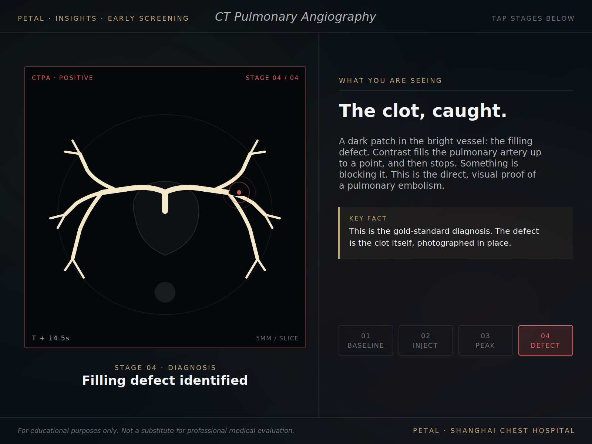
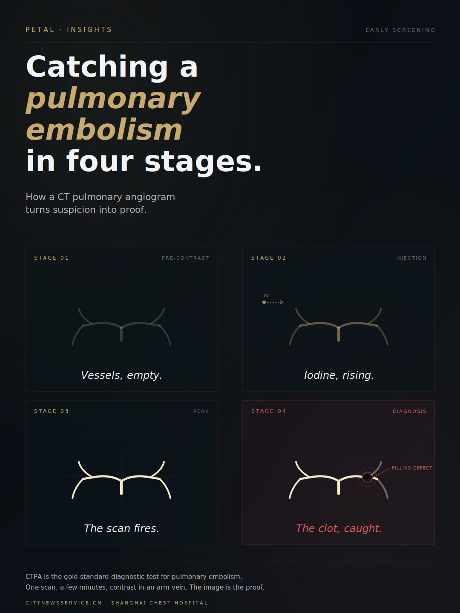
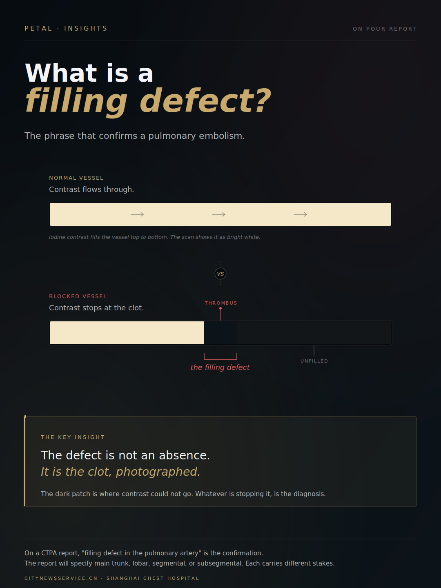
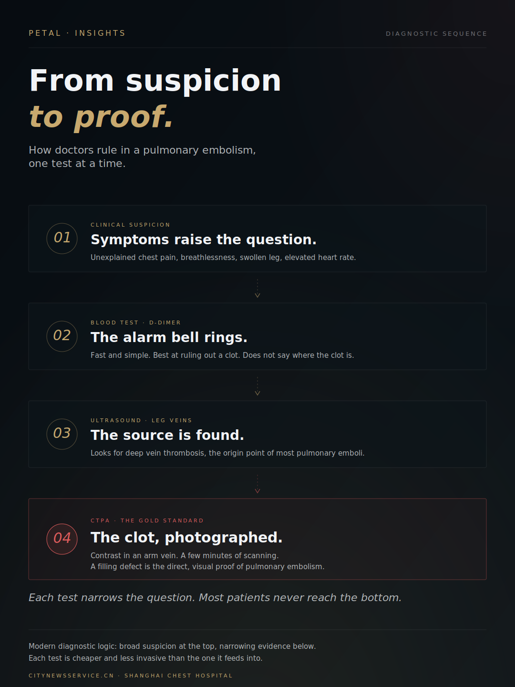

# PETAL Insights — Design System

The visual design system for the **PETAL Insights** series — sponsored health journalism on thrombosis prevention and treatment, published by [CNS (citynewsservice.cn)](https://citynewsservice.cn) in partnership with Shanghai Chest Hospital.

This repository is the canonical source for the series' visual identity. It is structured to be ingestible by AI design tools (Claude Design, Figma AI), readable by human designers, and version-controllable as the system evolves.

---

## What's in this repo

| Path | Purpose |
|---|---|
| `DESIGN_SYSTEM.md` | The full design system documentation. Color principles, typography, composition rules, tone, production formats. **Start here.** |
| `tokens/colors.css` | CSS custom properties for all color tokens. Importable into any web project. |
| `tokens/colors.json` | Machine-readable JSON of the same tokens, for design tooling. |
| `tokens/typography.css` | Font stack imports and type scale as CSS variables. |
| `tokens/typography.json` | Machine-readable JSON of the typography system. |
| `components/frame-template.html` | The standard PETAL frame: top series tag, hairline dividers, bottom branding. The backbone of every static graphic and interactive. |
| `components/stage-card.html` | The numbered stage card pattern used in funnels, sequences, and step-by-step compositions. |
| `components/key-insight-callout.html` | The gold-bordered key insight card used to land conceptual punch lines. |
| `components/vessel-tree.html` | Reusable SVG pulmonary artery tree at three contrast states (pre, mid, peak) with optional filling defect. |
| `examples/interactives/` | Screenshots of the in-article interactive embeds (Virchow's Triad, CTPA walkthrough). |
| `examples/statics/` | The complete WeChat static graphic set per article. |
| `fonts/README.md` | Font sources (all Google Fonts) with import URLs and licensing notes. |

---

## Quick reference — the visual identity in one sentence

> Modern, cosmopolitan, night mode editorial — the aesthetic of a thoughtful longform health publication, not a hospital brochure.

**Palette:** Deep near-black (`#070c11`–`#0d1419`) backgrounds. Warm gold (`#c8a96e`) primary accent. Cream-gold (`#f4e8c8`) for peak emphasis. Muted clinical red (`#e05c5c`) used sparingly for alert states only.

**Typography:** Cormorant Garamond (display, mix regular + italic), Outfit (body, light weights), DM Mono (small caps tags).

**Composition:** Generous negative space. One editorial idea per graphic. Critical elements discovered, not announced.

For full specifications, see [DESIGN_SYSTEM.md](DESIGN_SYSTEM.md).

---

## What this looks like in practice

### In-article interactive (CNS)

The CTPA walkthrough at the diagnostic moment (stage 4 of 4). Demonstrates the full PETAL system — frame chrome, vessel rendering at peak contrast, the filling-defect motif with red pulse rings, the right-panel editorial copy, the gold/red color logic, and the alert-state stage button.

### Static graphics for WeChat distribution

The standard three-graphic set produced for every PETAL article: hero, concept explainer, and sequence/funnel.

**Hero — the article's visual thesis (vertical 1080×1440)**

**Explainer — the single most important concept (vertical 1080×1440)**

**Sequence — broader pathway context (vertical 1080×1440)**

When generating new assets, refer to these examples as the canonical visual language. Anything new should feel like it belongs in this set.

---

## How to use this with Claude Design

Anthropic's Claude Design tool can ingest a GitHub repository as a project-level design system. To load this system:

1. In Claude Design, create a new project
2. Add this repository URL as the design system source: `https://github.com/[your-username]/petal-design-system`
3. Reference the design system in any prompt: *"Apply the PETAL design system. Create a [whatever you need]."*

Claude Design will read the CSS tokens, component templates, and example images, and apply them automatically to whatever you generate.

For best results, also reference specific examples in your prompts: *"Match the visual language of `examples/statics/wechat-hero-ctpa.png`."*

---

## How to use this with Figma

The CSS and JSON tokens in `tokens/` can be imported as Figma variables via the Figma Variables import feature, or via plugins like Tokens Studio for Figma.

The component HTML templates can be referenced as build specifications when creating Figma components.

---

## How to use this manually

If you're a designer working in any other tool, the design system is fully documented in `DESIGN_SYSTEM.md`. The hex values, font specifications, and composition rules are all explicit and copyable.

The `examples/` folder contains rendered output across the production formats so you can see the system in practice rather than just in description.

---

## Versioning

This system is at version 1.0, established through Sessions 1 and 2 of the PETAL Insights series (Virchow's Triad and CTPA / pulmonary embolism diagnosis).

As future sessions are produced and new patterns emerge, this repo will be versioned. The principle is consistency above novelty — every new asset should feel like part of the same series.

---

## Credits

PETAL Insights is produced by CNS (citynewsservice.cn) in partnership with Shanghai Chest Hospital. This educational series is supported by the Shanghai Health Science Communication Talent Development Program (JKKPYL-2024-B07).

The visual system was developed iteratively across Sessions 1 and 2, drawing on editorial design conventions from longform health publications and the constraints of the CNS content management system.
